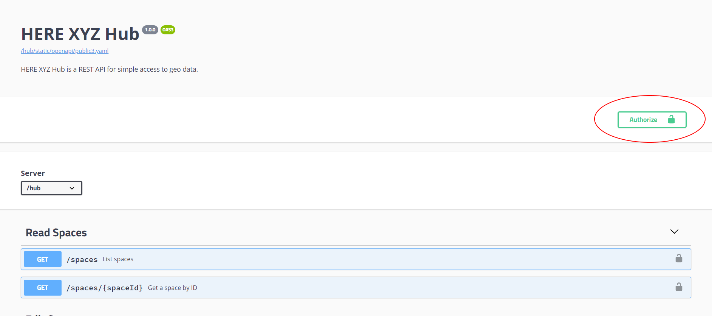

# Overview

Data Hub is a real-time cloud-based location hub for discovering, storing, retrieving, manipulating and publishing private or public mapping data.

It uses the concepts of **Spaces** to store your data. A Space is your own geospatial
data repository, which you can quickly create when needed to store data.

To interact with the HERE Data Hub API directly from your application you need to use HERE's public REST APIs. These are simple to use from any application environment - you only need to know how to make RESTful requests.

> #### Note
> 
> Data Hub is currently "[In Maintenance](https://developer.here.com/documentation/product-lifecycle-policy/customer_notice/index.html)". Interactive map layers (IML) has been identified as the successor to Data Hub. For new users considering Data Hub, HERE recommends that you start with IML on the [HERE platform](https://platform.here.com).
>
> For more information on IML, see the [Data API](https://developer.here.com/documentation/data-api/data_dev_guide/rest/layers.html).

## Authentication

For everything you want to do via the API, you need to use a token as described in the
[Generate Token Section](getting-token.md).

## Data

When you have a space it's easy to store any GeoJSON data you want in a Space and retrieve it when needed.
You do not have to worry about how to store data effectively if you want to use it on a map, and you don't have to understand the geospatial details. Your content is located in a safe place (the space) so it can be used efficiently on a map.

Spaces are by definition worldwide and can include any type of GeoJSON feature. Within each feature, you can have different `properties` as the payload information.

Every feature is identified by its `id` which is unique in the Space. You can read or update
features directly using this identifier. And if you don't provide it yourself, the API will generate it for you.

## Tags

To work efficiently with data, it is helpful to sub-divide it. Spaces allow you to do this with the use of `tags`. A Tag is a text that can be used with a subset of the data. Tags are optional for you or the owner of the Space you are working with.

You might want to use different tags for the different ways you want to use or style data.
For example, you might want to tag the Store location you place in a layer with the
amenities that the particular store provides (`coffee`, `food`, `late_night`). In addition
you could use `new` as a tag for newly opened stores you want to highlight and call out on
the map.

You can combine tags in a request by using `,` for `OR` and `+` for `AND`.

## Iterating

Another core concept when you are working Space is to [iterate](https://xyz.api.here.com/hub/static/redoc/#operation/iterateFeatures) over the content to gather everything that you are interested in.

If you access with *a lot* of data, you will retrieve it in parts. With the `limit` parameter, you tell the API how much data you want to see at once. The `handle` is something the
API gives you together with the data, which you need to provide back when you want to continue to get the next chunk of data.

## ReDoc API documentation

[`https://xyz.api.here.com/hub/static/redoc/`](https://xyz.api.here.com/hub/static/redoc/)

## Open API documentation

[`https://xyz.api.here.com/hub/static/swagger/`](https://xyz.api.here.com/hub/static/swagger/)

## Data Privacy

HERE is committed to respecting your privacy and to complying with applicable data protection and privacy laws. For more information, see the [HERE Privacy Policy](https://legal.here.com/en-gb/privacy).
