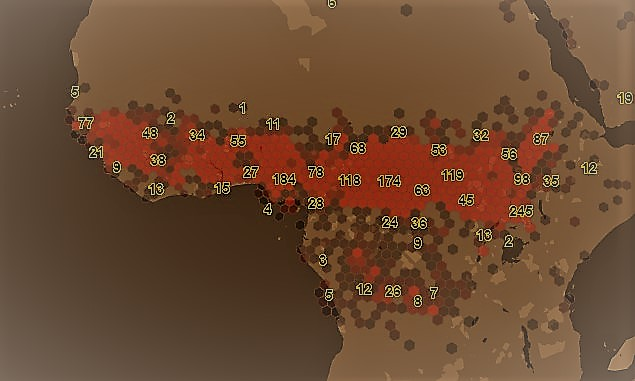

# Use Clustering - hexbin

This section describes how to retrieve features from Data Hub in a
hexbin clustered form. Two different clustering modes, "hexbin" and "quadbin", are available.

* "quadbin" - gives the amount of features in tiles and subtiles. Purpuse is to give a fast overview on dataset locations on lower zoom levels. The quadbins corresponds to the webmercator tiling scheme. 
* "hexbin"  - gives the amount of feature in a hexagonal tiling. Beside the amount of the features per hexbin it provides  statistics (min, max, avg, median) on a user-defined property.

## hexbin



### Get clustered Features in a Bounding Box

While retrieving features from Spaces inside a tile you can use "hexbin"
clustering to visualize your data as hexagons. Each hexagon represents the features of the area it
covers. Additional statistical information about one property of your data can be evaluated and
returned as properties of the returned hexagonal features.

The hexbin algorithm divides the world in hexagonal "bins" on a specified resolution.
Each hexagon has an address being described by the H3 addressing scheme.
For more information on that topic see: <https://eng.uber.com/h3/>

#### Request

*Try in [Swagger](https://xyz.api.here.com/hub/static/swagger/#/Read%20Features/getFeaturesByTile)*

```HTTP
GET /spaces/{spaceId}/tile/{type}/{tileId}?clustering=hexbin&clustering.resolution={aNumber}&clustering.property={aPropertyName}
```

The following clustering related parameters can be passed and combined with others ( e.g. tags, clip, feature filtering).

| Parameter   | Type    | Mandatory | Meaning                                                               |
|-------------|---------|-----------|-----------------------------------------------------------------------|
| absoluteResolution  | Number  | NO | integer, The H3 hexagon resolution [0,13], default:( s.b. Default Resolution for zoomlevel  ) |
| relativeResolution | Number  | NO | integer value [-2,2] to be added to current used resolution  |
| property    | String  | NO        | A property of the original features for which to calculate statistics |
| pointmode   | Boolean | NO        | retuns the centroid of hexagons as geojson feature                    |
| singlecoord | Boolean | NO        | force to evaluate the first object coordinate only (default: false)   |
| sampling    | String  | NO        | samplingratio of underlying dataset<br>values [off, low, lowmed, med, medhigh, high] (default: off)<br>off ~ (1/1),<br>low ~ (1/8),<br>lowmed ~ (1/32),<br>med ~ (1/128),<br>medhigh ~ (1/1024),<br>high ~ (1/4096)) |

#### Response

```JSON
{
    "type": "FeatureCollection",
    "features": [
        {
            "type": "Feature",
            "properties": {
                "kind" : "H3",
                "kind_detail" : "858b1303fffffff",
                "resolution": 5,
                "level": 7,
                "aggregation": {
                    "aPropertyName": {  // only if a clustering.property={aPropertyName} is specified. If not specified field "qty" is
                                        // written on this object-level (e.g. properties.aggregation.qty )
                        "avg": 30.05000,
                        "max": 44.1,
                        "min": 16,
                        "qty": 2,
                        "sum": 60.1
                    }
                },
            "centroid": [ ... ], // only if clustering.pointmode = false|null
            "hexagon": [ ... ]  // only if clustering.pointmode = true
            },
            "geometry": {...},
        },
        ......
        ......
        {
            "type": "Feature",
            "properties": {
                "kind" : "H3",
                 "kind_detail" : "881f1d4a81fffff",
                    ....
            },
            "geometry": {...}
        }
    ]
}
```

#### Miscellaneous

##### Default Resolution for zoomlevel

The parameter clusterning.absoluteResolution specifies the size of the hexagons wanted.
( s. <https://h3geo.org/docs/core-library/restable> )
The default Resolution is balanced to suit size and performance of hexbin calculations per tile for normal amounts of data. Various parameters like amount, density, distribution and object size plays a role in performance time. Higher resolution specific tile level, up to ( default + 2 ) can be specified on experimental base, depending on datasize. If the value of clusterning resolution exeeds the maximum value for tile level, the maximum resolution will be used instead.

|Zoomlevel|Default H3 Resolution|
|---|---|
|0|2|
|1|2|
|2|2|
|3|2|
|4|3|
|5|4|
|6|4|
|7|5|
|8|6|
|9|6|
|10|7|
|11|8|
|12|9|
|13|9|
|14|10|
|15|11|
|16|11|
|17|12|
|18|13|
|19|13|
|20|13|
|21|13|
|22|13|
