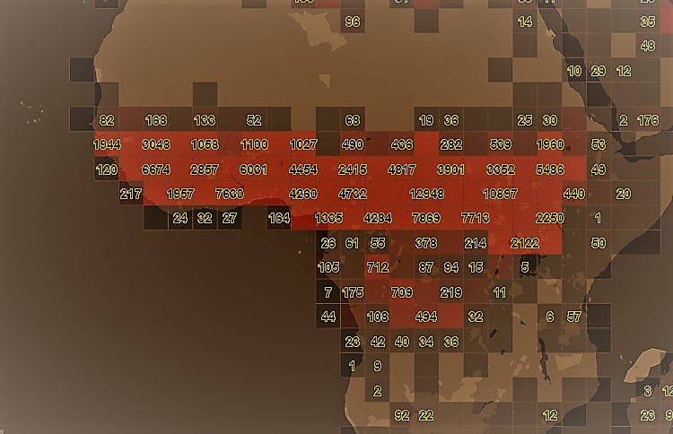

# Use Clustering - quadbin

This section describes how to retrieve features from Data Hub inside a tile in a
clustered form. Two different clustering modes, "hexbin" and "quadbin", are available.

* "quadbin" - gives the amount of features in tiles and subtiles. Purpuse is to give a fast overview on dataset locations on lower zoom levels. The quadbins corresponds to the webmercator tiling scheme. 
* "hexbin"  - gives the amount of feature in a hexagonal tiling. Beside the amount of the features per hexbin it provides  statistics (min, max, avg, median) on a user-defined property.


## quadbin



### Get clustered Features in a tile

The quadbin algorithm takes the geometry input from the request (e.g. quadkey / bbox..)
and does estimated count on the features contained in the space. This clustering mode works also for very large spaces and
can be used for getting an overview where data is geolocated in a given space. Furthermore,
a property filter on one property is applicable.

There are several parameters needed by the quadbin algorithm. You can use one property filter in combination.
#### Request

*Try in [Swagger](https://xyz.api.here.com/hub/static/swagger/#/Read%20Features/getFeaturesByTile)*

```HTTP
GET /spaces/{spaceId}/tile/{type}/{tileId}?clustering=quadbin&clustering.relativeResolution={aNumber}&clustering.countmode={cmode}
```

The following clustering related parameters can be passed

|Parameter   | Type    | Mandatory | Meaning                                                               |
|-------------|---------|-----------|-----------------------------------------------------------------------|
| relativeResolution | Number  | NO        | integer, The quad resolution [0,4]                                            |
| noBuffer    | Boolean | NO        | do not place a buffer around quad polygons, default: false            |
| countmode   | String  | NO        | [real, estimated, mixed]<br><br>real = real feature counts.<br>Best accuracy, but slow.<br>Not recommended for big result sets<br><br>estimated = estimated feature counts.<br>Low accuracy, but very fast<br>Recommended for big result sets<br><br>mixed (default) = estimated feature counts combined with real ones.<br>If the estimation is low a real count gets applied. Fits to the<br>most use cases|

#### Response

```JSON
{
    "type": "FeatureCollection",
    "features": [
        {
            "type": "Feature",
            "properties": {
                "qk": "12002323333",     // tile quadkey
                "xyz": "(639,1071,11)",  // tile row/col/level 
                "count": 30393,          // count of features in tile 
                "estimated": true,       
                "total_count": 33521484,      // total feature count in related space
                "equipartition_count": 511    // total_count/#Nr_Of_All_Level_Tiles
            },
            "geometry": {...}  
        },
        ......
        ......
        {
            "type": "Feature",
            "type": "Feature",
            "properties": {
                "qk": "12002323331",
                "xyz": "(638,1071,11)", 
                    ....
            },
            "geometry": {...}
        }
    ]
}
```


