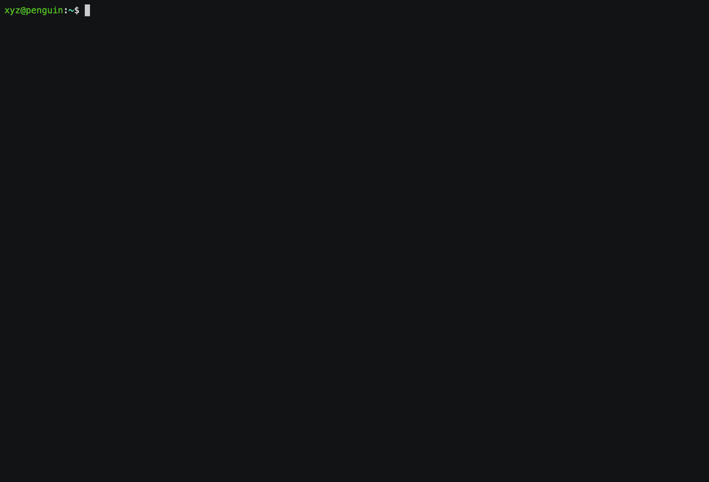

# Add-on features via HERE CLI

In this section we give you a quick overview of the advanced HERE CLI commands for Data Hub Add-on features
in Data Hub Spaces.

## Schema Validation for GeoJSON data

A JSON schema definition file can be configured for a space. Users can set the schema definition in the form of a URL or a local file. Features that do not match this schema will not be uploaded.

> #### Note
>
> Schema definition configurations and modifications will be applied to future data uploads, and not to existing data in a space.

### Configuring schema for a space

You can configure the JSON schema definition for an existing space using the 'config' command.

> #### Note
>
> Data Hub Schema Validation expects a GeoJSON feature schema to validate against the uploaded data.

#### Add/Update schema

To set a new schema definition or update an existing schema definition for a space using a local file or a URL:

```console
here xyz config YOUR_SPACE_ID --add --schema [LOCAL_FILE_PATH | SCHEMA_HTTP_URL]
```

You can add a schema definition to a space while creating it as well:

```console
here xyz create -t <SPACE_TITLE> -d <SPACE_DESCRIPTION> --schema [LOCAL_FILE_PATH | SCHEMA_HTTP_URL]
```

### View schema

To view the schema definition configured on a space:

```console
here xyz config YOUR_SPACE_ID --schema --view
```

Sample output:

```json
{
   "definitions": {},
   "$schema": "http://json-schema.org/draft-07/schema#",
   "$id": "http://example.com/root.json",
   "type": "object",
   "title": "The Root Schema",
   "required": [
      "geometry",
      "type",
      "properties"
   ]...
```

#### Delete schema

To delete a schema definition for a space:

```console
here xyz config YOUR_SPACE_ID --schema --delete
```

## Rule Based Tags

Rule Based Tags let you create tags on features using conditional rules applied against feature properties as you upload data to a space.

> #### Note
>
> Rule based tagging does not create tags on existing data you have on the space. It only tags the data you upload after setting the rules.

Tag rules can be set up for string, boolean or numeric properties. Multiple conditions can also be defined. The name of the rule you create is set as the name of the tag in the features that match those conditions.

> #### Important tip
>
> The property names inside the ***properties*** key of a GeoJSON feature need to be prefixed with a ***p.***, and those outside it, like the feature ID, need to be have an ***f.*** prefix.

Look at the following example feature and corresponding sample tag rule conditions:

```json
{
  "geometry": {
    "coordinates": [
      52.3828125,
      29.5352295
    ],
    "type": "Point"
  },
  "id": "987654321",
  "properties": {
    "averageInvoice": 25,
    "details": {
        "capacity": 20,
        "employeeCount": 10
        }
    "category": "Coffee Shop",
    "costCategory": "High",
    "opensEarly": true
    "name": "Data Hub Cafe"
  },
  "type": "Feature"
}
```

| Tag_name       | Auto_tag_condition         |
| :------------- | -----------:               |
|  coffeeShop    | p.category == 'Coffee Shop' |
|  opensEarly    | p.opensEarly == true         |
|  largeGroupFriendly | p.details.capacity > 16 && p.details.employee > 8 |
|  id@987654321     | f.id == 987654321     |

### Add a tag rule

```console
here xyz config <spaceId> –tagrules --add
```


e.g.

```console
$ here xyz config  HJtXzHWi --tagrules --add
Starting to add a new synchronous rule to automatically tag features..
? Enter a tag name you would like to assign :   => opensEarly

? Please enter condition(s) for the auto tagging your features with  `opensEarly` e.g. "f.id == 123 || (p.country=='USA' & p.count<=100)"
? condition :    => p.opensEarly == true
```

### View tag rules

```console
here xyz config <spaceId> –-tagrules  or here xyz config  <spaceId> –tagrules --view
```

### Delete tag rules

```console
here xyz config <spaceId>  –-tagrules --delete
```

### Update tagrule [Users can update tagrule name and conditions using update command]

```console
here xyz config <spaceId>  –-tagrules --update
```


e.g.:

```console
$ here xyz config 4HTUXtve --tagrules --update
? Select tag rule to be updated (Use arrow keys)
  largeGroupFriendly , rule : p.details.capacity > 16 && p.details.employees > 8 , mode : sync
> coffeeShop , rule : p.category == "Coffee Shop" , mode: sync
  opensEarly , rule : p.opensEarly == true , mode : sync

? Press ENTER to keep existing tag name OR type new tag name => coffee_shop

  Press ENTER OR type condition(s) for this tag rule. e.g. "f.id == 123 || (p.country=='USA' & p.count<=100)"
? condition : => p.category == "Coffee Shop" || p.category == "Coffee Bar"

tagrules updated successully!
```

## Searchable Properties

Data Hub automatically indexes certain properties based on the number of features in your space. If a property is not automatically indexed, you can force it to be indexed using the `--searchable` option.

### Add Searchable Properties

```console
$ here xyz config <spaceId> --searchable --add
? Enter the property name to make searchable (create index on ):    =>  address
```



### View Searchable Properties

```console
here xyz config <spaceId> --searchable --view
```

e.g

```console
$ here xyz config fgtdc6tz --searchable –-view

| PropertyName       | Mode         | Searchable     |
| ------------------ | ------------ | -------------- |
|  city              | Auto         |   true         |
|  address           | Manually     |   true         |
```

### Delete Searchable Properties [User can delete one or all searchable properties using delete command]

```console
here xyz config <spaceId> --searchable --delete
```


## Activity Log

Activity Log tracks what has been written, modified, and deleted in a Data Hub Space. The changes are written to a second space, with options to show

- FEATURE_ONLY (default): Just the full new version of the feature, with the id moved. No diff to previous.
- DIFF_ONLY: Head (newest object) is the full feature. All older versions are only a Diff to the successor. In order from newest to oldest: Obj1: Newest, full Feature + Diff to Obj2-> Obj2: Diff to Obj3 -> Obj3: Diff to Obj4 -> Obj4 …
- FULL

### Check or enable Activity Log

```console
here xyz config <spaceId> --activitylog
```


e.g:

```console
$ here xyz config jsopziJd --activitylog
activity log for this space is not enabled.

? Select action for activity log (Use arrow keys)
> enable activity log for this space
  cancel operation

? Select storage mode for activity log (Use arrow keys)
> full - store whole object on change
  diff - store only the changed properties

? Select state (number of change history to be kept) for activity log** (Use arrow keys)
  1
> 2
  3
  4
  5

activity log configuration updated successfully, it may take a few seconds to take effect and reflect.
```

You can use the same command to check the activity log status, disable or re-configure the activity log settings


## Virtual Spaces

> #### Note
>
> To use this feature, your account needs access to the Data Hub Add-on Services.

Virtual Spaces give users access to multiple spaces with one ID. Group lets you bundle your spaces together, and changes get written back to their original spaces. Associate lets you make your own personal edits to a shared space or one with public data, merging the properties of objects with the same feature ID.

```console
here xyz virtualize|vs -a|-g space1,space2
```

### Group

```console
here xyz virtualize -g space1,space2,...
```

`group` takes multiple Data Hub spaces and presents them via a single Data Hub space ID. Duplicates can occur. Any updates will be made to the original spaces.

### Associate

```console
here xyz vs -a space1,space2
```

`associate` takes features from `space1` and merges their properties into features with the same feature id in `space2`.

One way of using `virtualize` is to upload CSVs of census data with unique geoID, and merge the statistics on the fly into census geometries where the geoID is the unique ID.

### Options

`-t,--title [title]` Title for virtual Data Hub space

`-d,--message [message]` set description for the space

`-g, --group [spaceids]` Group the spaces (all objects of each space will be part of the response) - enter comma separated space ids

`-a, --associate [spaceids]` Associate the spaces. Features with same id will be merged into one feature. Enter comma separated space ids [space1,space2] -- space1 properties will be merged into space2 features.

`-h, --help` output usage information

### Join (Virtual Spaces)

The `join` command simplifies use of virtual spaces when using CSV tables and existing geometries. You can designate a CSV column to be the feature ID, and use the `associate` virtual spaces option to join it with a space with geometries that use the same set of feature IDs.

```console
here xyz join space_with_geometries -f data_table.csv -k column_with_id
```

> #### Note
>
> `join` creates a space of features with no geometries. You can inspect this space using geojson.tools via `show -w`
>
> You can update this "csv space" using `here xyz upload spaceID -f new.csv -k id --noGeom` and the next time the virtual space ID is references, the properties will contain the updated values.

#### Join Options

`-f, --file <file>`   csv to be uploaded and associated

`-k, --keyField <keyField>`  field in csv file to become feature id

`-x, --lon [lon]`                 longitude field name
  
`-y, --lat [lat]`                 latitude field name
  
`-z, --point [point]`             points field name with coordinates like (Latitude,Longitude) e.g.(37.7,-122.4)

`--lonlat`                         parse a —point/-z csv field as (lon,lat) instead of (lat,lon)

`-d, --delimiter [,]`             alternate delimiter used in csv (default: ",")

`-q, --quote ["]`                 quote used in csv (default: "\"")

`--token <token>`               a external token to create another user's spaces

`-s, --stream`                    streaming data for faster uploads and large csv support

`--string-fields <stringFields>`  property name(s) of CSV string fields *not* to be automatically converted into numbers or booleans (e.g. number-like census geoids, postal codes with leading zeros)

`-h, --help`                      display help for command

> #### Note
>
> `join` creates a space of features with no geometries. You can inspect this space using geojson.tools via `show -w`
>
> You can update this "csv space" using `here xyz upload spaceID -f new.csv -k id --noGeom` and the next time the virtual space ID is references, the properties will contain the updated values.

## GIS

The CLI has access to a number of convenient geopspatial data functions via the `here xyz gis` command. Some of these functions add properties to the original features, while others create data in a new space. These functions are based on popular JavaScript tools like turf.js and D3, and are [designed to be modular](https://github.com/heremaps/here-cli/blob/master/src/gisUtil.ts) so you can easily add your own.

### Options

`--centroid`             calculates centroids of Line and Polygon features and uploads in  
                         a different space

`--length`               calculates length of LineString features

`--area`                 calculates area of Polygon features

`--voronoi`              calculates Voronoi Polygons of point features and uploads in
                         different space

`--tin`                  calculates Delaunay Polygons of point features and uploads in
                         different space

`--property <property>`  populates Delaunay polygons' properties based on the specified
                         feature property

`-c, --chunk [chunk]`    chunk size, default 20 -- default for polygons, increase for
                         faster point feature uploads

`-t, --tags <tags>`      source space tags to filter on

`--samespace`            option to upload centroids/voronoi/tin to same space, use tags to
                         filter

`-h, --help`             display help for command

- `--area` uses `turf.js` to calculate the area of polygons, and saves this as a set of new properties in each polygon feature. `xyz_area_sqmiles`,`xyz_area_sqkm` are rounded for display convenience, and `xyz_area_sqm` is not rounded.
- `--length` uses `turf.js` to calculate the length of lines in a space, and saves this as a set of new properties in each linestring feature, `xyz_length_miles`,`xyz_length_km` which are rounded for display convenience, and `xyz_length_m` which is not rounded.
- `--centroid` uses `turf.js` to calculate the center of each polygon in a space. By default, these points are written to a new space, but can saved in the existing space using the `--samespace` option. In either case, they all receive a `centroid` tag.
- `--voronoi` uses `d3-delaunay.js` to generate Voronoi polygons from points in a Data Hub space. The edges of these polygons are equidistant from two points, and the vertices are equidistant to three points. By default, they are written to a new space, but can saved in the source point space using the `--samespace` option. In either case, they all receive a `voronoi` tag.
- `--tin` uses `d3-delaunay.js` to generate Delaunay triangles from points in a Data Hub space. This process maximizes the minimum angle of all the angles of the triangles created from the source points. By default, they are written to a new space, but can saved in the source point space using the `--samespace` option. In either case, they all receive a `tin` tag.

## CLI Hexbins

CLI Hexbins are a data simplification method that makes it easier to visualize large datasets of point features at low zoom levels (e.g. a continent, country, or state/province). A series of hexagon grids are created and the points that fall inside each are counted and written to a new Data Hub space, and statistics are calculated across the hexbin grid.

These differ from the H3 hexbins generated via server-side clustering in a number of ways. CLI Hexbins use the `iterate` endpoint to calculate and write hexbins to a space across the specified zoom levels, while server-side hexbins are generated on the fly for each zoom level. CLI Hexbins for a specified zoom level can be viewed at any other zoom level using tags -- for example, CLI hexbins or their centroids generated at zoom level 15 can be viewed at zoom 5 via the hexbin space, whereas server-side hexbins cannot. Server-side hexbins have detailed statistics for the values in a particular hexbin, but CLI hexbins have built-in color formatting and global "occupancy" percentages. CLI hexbins also can generate "subcounts" of unique values across a dataset.

These hexagons (or their centroids) and their statistics can be quickly displayed in place of the raw data that might overwhelm a renderer. Default colors indicating relative "occupancy" are generated for convenience of display.

  `here xyz hexbin spaceID -z 5-10` create hexbins appropriate for zoom levels 5 through 10

  `here xyz hexbin spaceID -z 8,10,12` create hexbins appropriate for zoom 8,10,12

   `here xyz hexbin spaceID -c 100,1000,100000` create hexbins that are 100 meters, 1km and 10km wide

Hexbins are tagged by zoom level, width, and type, making it easy to extract one set from the hexbin space for display and comparison.

You can learn more about hexbins and how to display them [in this tutorial](tutorials/cli_hexbins.md).

### Data contained in Data Hub Hexbins

Hexbin features contain various values that can help with analysis and visualization:

- `count`: the number of points in a hexbin
- `maxCount`: the largest number of points in any hexbin across that particular zoom level or cell width
- `occupancy`: `count/maxCount`, how "full" that hexbin is compared to other across that particular zoom level or cell width
- `color`: an `hsla` color range that correlates to relative occupancy (red = "full", green = "average", blue = "empty
- `centroid`: the centroid of the hexbin (useful for label placement -- the centroid is also written as a separate feature)

```json
      "properties": {
        "color": "hsla(0, 100%, 50%,0.51)",
        "count": 468,
        "maxCount": 468,
        "occupancy": 1,
      },
      ...
      "properties": {
        "color": "hsla(81, 100%, 50%,0.51)",
        "count": 279,
        "maxCount": 468,
        "occupancy": 0.5961538461538461
      },
      ...
      "properties": {
        "color": "hsla(197, 100%, 50%,0.51)",
        "count": 6,
        "maxCount": 468,
        "occupancy": 0.01282051282051282...
      }
```

### Hexbin sum and average

If a property is qualitative (property values, income, population), in addition to counting points, Data Hub Hexbins can add up the value of the properties in each hexbin as well as calculate the average.

```console
$ here xyz hexbin spaceID -z 10 -a incidents
"sum": {
  "sum": 4071,
  "maxSum": 5117,
  "average": 8.698717948717949,
  "property_name": "incidents"
}
```

### Hexbin subcounts

You can also specify a `subcount` within each hexbin based upon the count of the values of particular property.

```console
`here xyz hexbin spaceID -z 8-12 -p business_type`
```

This would create a `subcount` object in each hexbin, which would contain the relative count of that property value across the hexbin grid.

```json
        "count": 48,
        "maxcount": 400,
        "subcount": {
          "bar": {
            "color": "hsla(181, 100%, 50%,0.51)",
            "count": 3,
            "maxCount": 32,
            "occupancy": 0.09375
          },
          "grocery_store": {
            "color": "hsla(158, 100%, 50%,0.51)",
            "count": 5,
            "maxCount": 24,
            "occupancy": 0.20833333333333334
          },
          "restaurant": {
            "color": "hsla(0, 100%, 50%,0.51)",
            "count": 20,
            "maxCount": 40,
            "occupancy": 1
          }...
```

### Options

`-c, --cellsize <cellsize>`      size of hexgrid cells in meters, comma-separate multiple  
                                 values

`-i, --ids`                      add IDs of features counted within the hexbin as an array
                                 in the hexbin's feature property

`-p, --groupBy <groupBy>`        name of the feature property by which hexbin counts will  
                                 be further grouped

`-a, --aggregate <aggregate>`    name of the feature property used for aggregating sum
                                 value of all the features inside a hexbin

`-r, --readToken <readToken>`    token of another user's source space, from which points
                                 will be read

`-w, --writeToken <writeToken>`  token of another user's target space to which hexbins
                                 will be written

`-t, --tags <tags>`              only make hexbins for features in the source space that
                                 match the specific tag(s), comma-separate multiple values

`-b, --bbox [bbox]`              only create hexbins for records inside the bounding box
                                 specified either by individual coordinates provided
                                 interactively or as minLon,minLat,maxLon,maxLat (use “\ “
                                 to escape a bbox with negative coordinate(s))

`-l, --latitude <latitude>`      latitude which will be used for converting cellSize from  
                                 meters to degrees

`-z, --zoomLevels <zoomLevels>`  hexbins optimized for zoom levels (1-18) - comma separate
                                 multiple values(-z 8,10,12) or dash for continuous
                                 range(-z 10-15)
  
`-h, --help`                     display help for command

You can create hexbins either by width in meters, or use preset widths appropriate to the zoom level.
