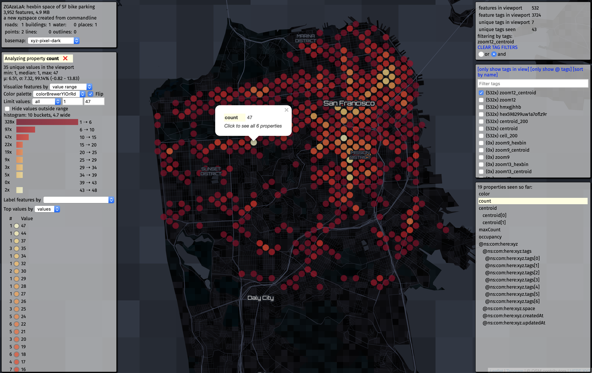
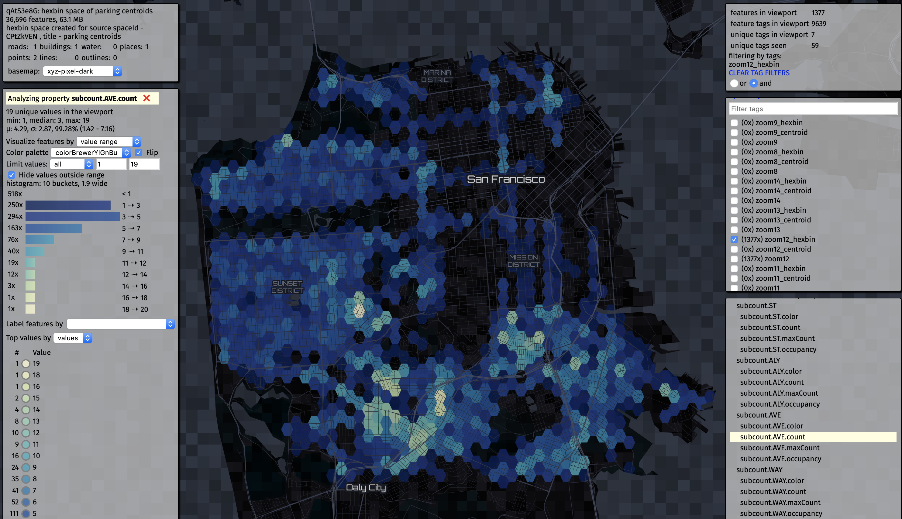
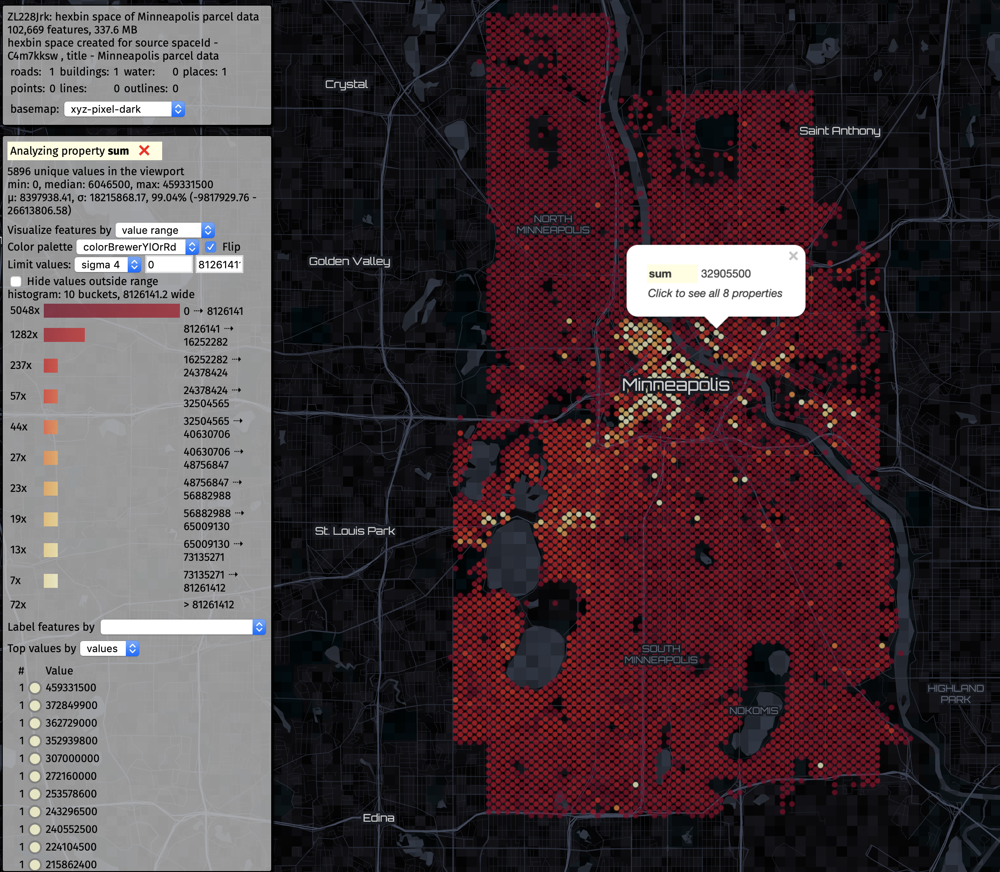

# Hexbins

## Creating hexbins with the HERE Data Hub CLI

The `hexbin` command in the HERE Data Hub CLI lets you easily create hexbins and their centroids from large, dense point datasets in your Spaces. Hexbins can be useful for data analysis, and can also allow you to visualize datasets that are too large to effectively view at low (regional or national) map zoom levels.

## Getting started

If you don't already have a set of points in a Space, you can upload them using the CLI.

```sh
here xyz upload -f your.geojson
smap
```

(You can also use a CSV with point coordinates or shapefiles.)

If you do not have data handy, you can use this CSV of [bicycle parking in San Francisco](https://data.sfgov.org/Transportation/Bicycle-Parking/hn4j-6fx5).

```sh
here xyz upload -f "https://data.sfgov.org/api/views/hn4j-6fx5/rows.csv"
```

You'll be prompted to enter a title and description, and Data Hub will generate a unique ID for your dataset. Copy this as you will need it to access the data and generated hexbins.

> #### Note
>
> Some of the features in this file do not have any coordinates -- the HERE Data Hub CLI will 
> report these as errors.

After the upload finishes, you can preview the map using geojson.tools

```sh
here xyz show spaceID -w
```

or [Space Invader](../space-invader/index.md). (Note it will be easier to view data sets larger than a few hundred points using Data Hub Space Invader.)

```sh
here xyz show spaceID -v
```

### Creating hexbins

Hexbins have a width in meters. You can set this manually using `-c`, but you also can use `-z` to generate a hexbin grid that fits well with a particular slippy map zoom level.

```sh
here xyz hexbin spaceID -c 100

here xyz hexbin spaceID -z 10
```

You can also define multiple zoom levels, or a range:

```sh
here xyz hexbin spaceID -z 10-13
here xyz hexbin spaceID -z 8,10,12
here xyz hexbin spaceID -c 100,200,400,800
```

For reference, here's a rough guide of zoom levels and admin hierarchies:

```console
city: zoom 10-13
region: zoom 7-10
country: zoom 4-7
world: zoom 1-4
```

Hexbins will generate a hexagonal grid for each zoom level (or width) that you selected. It will then count the points that fall within each hexagon, and save that to the properties of each hexbin.

It also tracks the maximum count seen in that grid, and after the pass is completed, it writes that `maxCount` value to each hexbin. An `occupancy` rate is then calculated for each hexbin relative to the rest of that grid, and a scaled `hsla` color value is written to the feature for display convenience (blue is low, red is high).

### Using tags with hexbin data

If we generate hexbins for Data Hub Space containing the bike parking locations...

```sh
here xyz hexbin spaceID -z 9-13
```

the CLI will generate tags so you can pull out the hexbins and centroids for each zoom level:

```console
zoom9
zoom9_hexbin
zoom9_centroid
zoom10
zoom10_hexbin
zoom10_centroid
...
```

The CLI also creates centroids for each hexbin. This is useful for an alternate display method as well as for labels. You can use tags to pull these out separately from the hexbins.

After you generate the hexbins from a Data Hub space, you can view them with any GeoJSON viewer. If you want to view just the zoom 11 hexbins, you can use the `-t` option with view:

```sh
here xyz show spaceID -w -t zoom11_hexbin
```

For convenience, here is a link to that data. Note the `&tags=zoom11_hexbin` -- that tells the Data Hub API to only return features with that tag, and thus that zoom level.

<http://geojson.tools/index.html?url=https://xyz.api.here.com/hub/spaces/ZGAzaLaA/search?limit=5000&clientId=cli&tags=zoom11_hexbin&access_token=APwC9OKv8ww_zMGWqPTSQdg>


### Data contained in Hexbins

Hexbin features contain various values that can help with analysis and visualization:

- `count`: the number of points in a hexbin
- `maxCount`: the largest number of points in any hexbin across that particular zoom level or cell width
- `occupancy`: how "full" that hexbin is compared to other hexbins across that particular zoom level or cell width (`count` divided by `maxCount`)
- `color`: an `hsla` color value that correlates to that hexbin's relative occupancy (red = "high", green = "average", blue = "low", provided for display convience
- `centroid`: the centroid of the hexbin (useful for label placement -- the centroid is also written as a separate feature)

```json
"properties": {
    "color": "hsla(0, 100%, 50%,0.51)",
    "count": 468,
    "maxCount": 468,
    "occupancy": 1,
},
...
"properties": {
    "color": "hsla(81, 100%, 50%,0.51)",
    "count": 279,
    "maxCount": 468,
    "occupancy": 0.5961538461538461
},
...
"properties": {
    "color": "hsla(197, 100%, 50%,0.51)",
    "count": 6,
    "maxCount": 468,
    "occupancy": 0.01282051282051282...
}
```

You can also open the hexbin space in Data Hub Space Invader and select zoom levels from the tag list.

```sh
here xyz show spaceID -v
```

In Space Invader, you can select properties and choose data-driven color palettes, and change the basemaps to suit the data.

If you do not choose a tag with `-t` in the CLI, you can select a zoom level using the tags in the right pane.



<!-- markdown-link-check-disable-line --><https://s3.amazonaws.com/xyz-demo/scenes/xyz_tangram/index.html?space=ZGAzaLaA&token=APwC9OKv8ww_zMGWqPTSQdg&basemap=xyz-pixel-dark&buildings=1&label=undefined&colors=range&points=2&lines=0&outlines=0&highlight=0&places=1&roads=1&water=0&tags=zoom12_centroid&property=count&palette=colorBrewerYlOrRd&paletteFlip=true&sort=values&hideOutliers=false#12.858333333333318/37.7474/-122.4452>

Click for more examples on how to use [Space Invader](../space-invader/index.md).

## Advanced options

### Subgroups

Values of properties of a feature can also be counted with `here xyz hexbin -p propertyname`.

```sh
here xyz hexbin spaceID -p street_type
```

This would count the unique values of the `street_type` property in each feature, track the maximum, and generate an occupancy value to be used in data visualization. Space Invader can use that value to dynamically generate a color based on that hexbin's subgroup value compared to other hexbin's subgroup values.

<!-- markdown-link-check-disable-line -->Here's an example [showing street types in San Francisco](https://s3.amazonaws.com/xyz-demo/scenes/xyz_tangram/index.html?space=qAtS3e8G&token=AFbjoHrBlTB2K5_gqvcP_S8&basemap=xyz-pixel-dark&buildings=1&label=undefined&colors=range&points=2&lines=0&outlines=1&highlight=0&places=1&roads=1&water=0&tags=zoom12_hexbin&property=subcount.AVE.count&palette=colorBrewerYlGnBu&paletteFlip=true&rangeFilter=0&sort=values&hideOutliers=true#13.166666666666664/37.7568/-122.4384), where street type was chosen as a subgroup. `subcount.AVE` can be used to see where Avenue is the most common street type. You can click on `subcount.ST.count` to see the streets of San Francisco.



For reference, [here is a sample of a subcount object](http://geojson.tools/index.html?url=https://xyz.api.here.com/hub/spaces/qAtS3e8G/search?limit=5000&clientId=cli&tags=zoom10_centroid&access_token=AFbjoHrBlTB2K5_gqvcP_S8):

```json
"properties": {
  "count": 468,
  "maxCount": 468,
  "subcount": {
    "ST": {
      "color": "hsla(0, 100%, 50%,0.51)",
      "count": 324,
      "maxCount": 324,
      "occupancy": 1
    },
    "ALY": {
      "color": "hsla(0, 100%, 50%,0.51)",
      "count": 16,
      "maxCount": 16,
      "occupancy": 1
    },
    "AVE": {
      "color": "hsla(107, 100%, 50%,0.51)",
      "count": 57,
      "maxCount": 122,
      "occupancy": 0.4672131147540984
    },
```

### Sum and average

If a point feature has a quantitative property, you can use `-a` to add it up within each hexbin, as well as calculate an average. These values, along with `maxSum`, is recorded in a `sum` object within each hexbin.

```json
"sum": {
  "sum": 4071,
  "maxSum": 5117,
  "average": 8.698717948717949,
  "property_name": "incidents"
}
```

Space Invader can compare and color these values across the hexbin grid. Here we see the aggregate values of Minneapolis property values summed within hexbin centroids.



### Updates

Data Hub tracks the source space of a hexbin space, and vice versa. If you add zoom levels or update hexbins, Data Hub will add to or edit any existing hexbin spaces for a source space.

You can see in the description of the space, using `here xyz config spaceID -r`. Hexbin zoom levels are also tracked.

### Dynamic zoom

Since each zoom level can have its own hexbins and centroids, you can dynamically select data appropriate for the zoom level of a map using tags. Here's an example of centroids and hexbins for tornados in the United States from 1950 to 2017.

<https://burritojustice.github.io/noaa_historic_tornadoes/>
