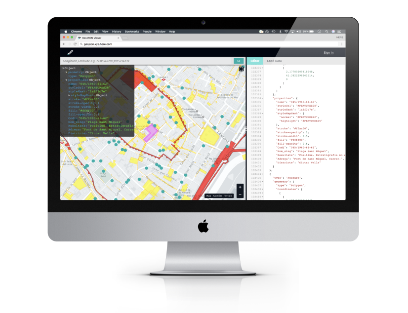
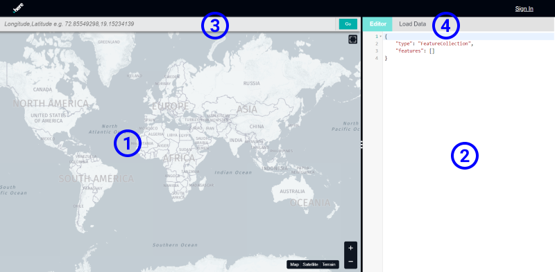
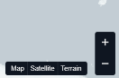
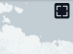
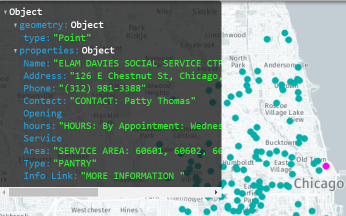
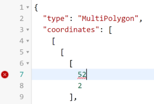
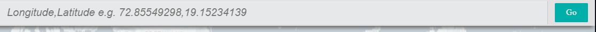
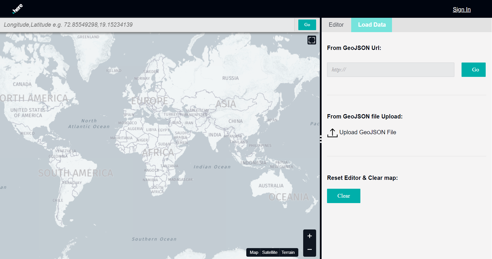
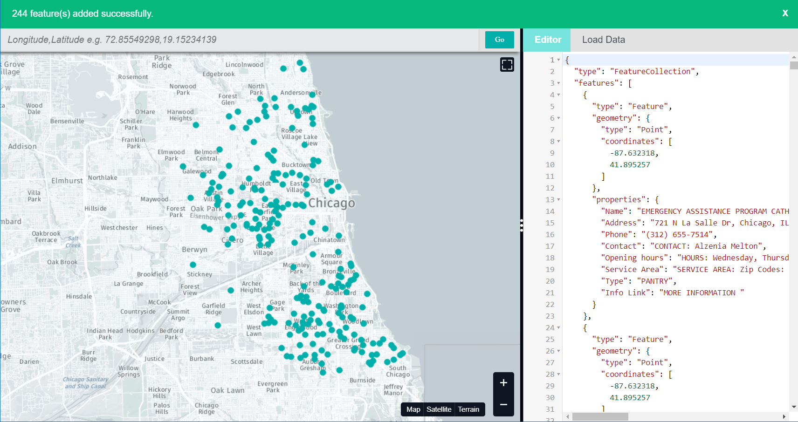

## Overview

The GeoJSON Tool is a web based visualization tool for [GeoJSON data](topics/geojsonbasics.md)
that can quickly display data from various sources, highlight and inspect specific features and supports even complex operations like finding data based on content.

> #### Hint
> GeoJSON Tool URL
> Bookmark the GeoJSON Tool at:
> 

***
    
    

## Getting around

### Map (1)

The map display makes up the biggest part of the tool. It is here where you see your data on the
background of the map.
You can freely navigate around and zoom in and out to get a better view.

#### Map Controls

You can also use the controls in the bottom right hand corner of the map view to zoom in and out, as
well as switching the background map style.

#### Full Page Map

Use the button in the top right hand corner to maximize the map to the full page to get a better view
of the data in context.

#### Data Overlay

When you work with data on the map and select one feature, this features highlights on the map a
magenta color. At the same time, the payload properties are shown in a heads-up data overlay in
the top left hand corner of the map, where you can drill down into the individual attributes

### Editor (2)

On the right hand side of the page you see the GeoJSON text editor. Here you can type or paste
GeoJSON describing the features you want to see on the map.

[]

> #### Info:::GeoJSON structure
> You will notice that the editor does some automatic formatting on the text you 
> are typing to bring into a structured form. This indenting makes it easier to work
> with the nested nature of GeoJSON.
> 
> In the left margin of the panel you notice line numbers, as well small triangles. 
> The latter allow you to collapse or expand regions of the text that you don't want 
> to see right now:

    
    
 

#### Fail: GeoJSON Syntax Check
 
 In addition to outlining the structure, the editor also checks if the GeoJSON is valid. 
 A missing a bracket or a comma can make your GeoJSON invalid for display. The editor tries 
 to give you a hint by showing a marker in the margin.

    
    

### Location bar (3)

On top of the map you find the Location bar. It allows you to quickly jump to any coordinate you enter:

### Loading Data (4)

There are of course more ways to get data into the viewer than typing into the editor. When you select the
**Load Data** on top of the editor, you have the option to

* Load data from a URL by typing it in and clicking **Go**
* Upload a local file from you computer
* Clear the map and start afresh

> #### Hint
> You can also load a local file by **drag&drop** meaning you pull it from your desktop or 
> Finder/Explorer on the map.

When data was loaded into the viewer, you either get a confirmation or a warning banner depending on if the
source could processed or not.

