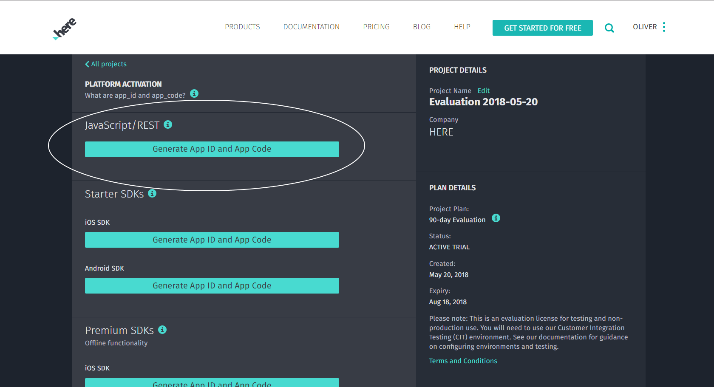

## Non-Developers

If you are do not want to code to make a map or store your data, have a look at **[HERE Studio](studio/topics/index.md)**. It guides you through the steps of building your own maps - no coding required.

## Developers

To use HERE Data Hub as a developer you need a couple of things that we'll explain below. For one, you want to be a HERE Developer to access any of our APIs (it's free, and no credit card required).

Next you probably want to have more control over what your doing. You can install
**[HERE CLI](cli/index.md)** to drive a lot of things right from your commandline.

If you are building a web application and want to show a map with your data have a look at our
**[Data Hub Map JavaScript](ui/index.md)** as it was built to show and style Space data on a map.

To integrate Data Hub data features into a mobile, web or server application you can make
REST calls to the **[Data Hub APIs](api/index.md)** to work with data directly.

### Become a HERE Developer

You need to become a HERE Developer to access the cloud-based APIs. Simply go to
[`https://developer.here.com`](https://developer.here.com) and select **Get started for free** to
go with the Freemium offer (btw - no credit card needed).

### Get your `appId`&`appCode`

Once you are in, you need to generate an `appId`&`appCode` in the **JavaScript/REST** section of the
project.

A couple of seconds after you selected the **Generate App ID and App Code** button you should see both
in the dialog. You can always get back to this, but now it's good time to make a note of both.

## Generating Tokens

Once you've received an AppID and App Code for Data Hub, you can generate a token by going to the **Data Hub Token Generator** site:

[`https://xyz.api.here.com/token-ui/`](https://xyz.api.here.com/token-ui/)

(You can learn more about [Tokens here](api/getting-token.md)).

## Get started with Data Hub

Now that your credentials have been generated with Data Hub, you're good to go! Learn more about Data Hub through [tutorials](https://developer.here.com/tutorials?category=HERE%2BXYZ), [the CLI](cli/index.md), or [API documentation](api/index.md)
