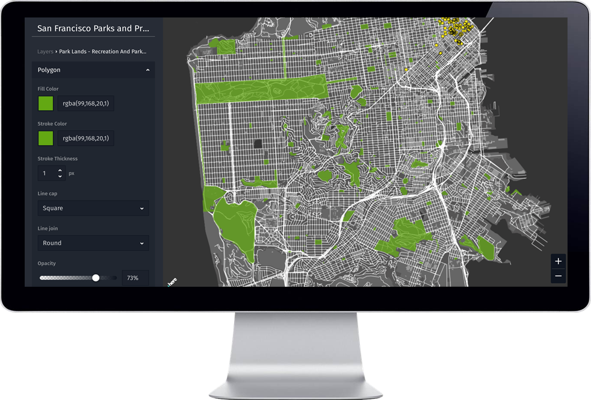

## Make great maps easier and faster

HERE Data Hub is an open, interoperable and real-time location data management service from HERE Technologies
that offers simple APIs, SDKs, components, and interactive tools
that enable everyone to make maps easier and faster.

[](assets/images/studio.png)

At its heart HERE Data Hub is a collection of tools and APIs to enable everyone to easily
manage map data and build great maps. It is built around standards like
[GeoJSON](http://geojson.org/) and designed to be **open** and **interoperable**
with many other offerings. Most important of all, HERE Data Hub offers
real-time **live** interaction with location data.

It's built from the ground up with productivity in mind. We have taken code and concepts used internally at
[HERE Technologies](https://www.here.com/) for years in some of the most demanding
projects and want to share that with the community of developers, cartographers and
enthusiasts to enable everyone to build better maps.

## Quick start

The easiest way to get started is to have a look at easy to use the **[HERE Studio](https://studio.here.com/)** web application to build and publish maps. Give it a try, it's completely free and open to use for everyone - you only need a HERE Account. Have a look at our
**[documentation](studio/topics/index.md)** for find out more about it.

When you have a GeoJSON file you just want to have a look at without building a full map, check out our open **[GeoJSON Tool](cli/viewer-tool/index.md)** tool. It's a great way to inspect data you'd want to work with.

If you are a developer and want to use our cloud services, you need an `appId`,
which you can get for free from the **[HERE Developer Portal](https://developer.here.com/)**.
See our **[getting started guide](getting-started.md)** for more details.

Then, install the latest version of our CLI with `npm`:

``` sh
npm install -g @here/cli
```

## What to expect

* Powerful **map data management** and **display tools** that make working with
  map data convenient and effective. The tools are easy to understand even if
  you have no prior experience with geospatial, location or projections concepts.

* A free **cloud service** to store and access data for your maps with
  straightforward **RESTful API** calls and a flexible **CLI**. The choice
  is yours. It also gives you access to a wide variety of free and open datasets.

* **UI components** that make it easy to **show and style data** and content exactly how
  you want to see it. It works well with huge amounts of data and also enables
  **rich interactive** and **real-time** experiences.

For detailed instructions on the prerequisites see our **[getting started guide](getting-started.md)**.
