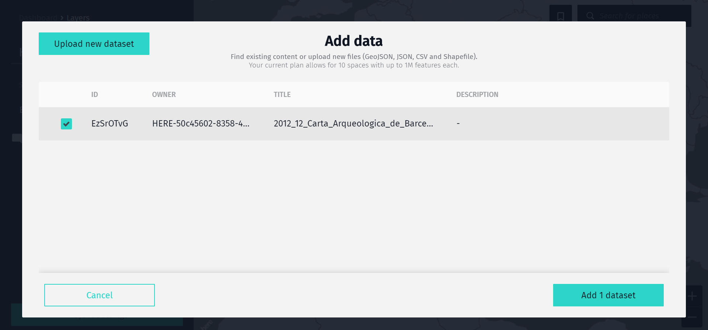
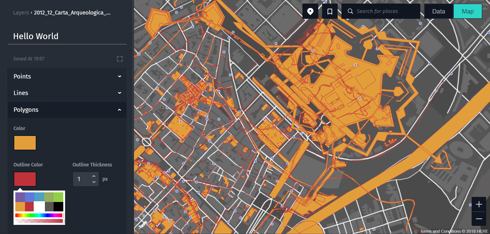

**[HERE XYZ Studio](https://xyz.here.com/studio)** is an interactive, visual, web-based application for accessing XYZ Hub data and creating maps within minutes - without any code.

Just go to - **[`https://xyz.here.com/studio`](https://xyz.here.com/studio)** - and log in.

## Dashboard

When you first open the application, you will start at the dashboard, where you can see all of the maps you have created. It is empty when you first get started, but it will fill up as soon as you begin creating projects.

## Create new project

You can quickly create a new map project by clicking on the button near the top. This takes you into the **Project workspace**.

Every map has at least a basemap, which you can style by picking from the list of themes provided.
But to make an interesting project, you need to put some data on top of that map.

The *data* will stored
in a Space on the Hub for you and nobody else can see it until you start sharing it. In addition,
you can *style* your data so it looks like you want to see it. The combination of data+style
is called a *layer*. You can add many layers to make your map and put them on top of each other.

## Upload your data

You can create a layer and upload data by clicking on the `+ Add` command below your project name.
This brings up a data selection dialog where you can pick from data that you already have in your Hub, or upload a new file. This file would preferably be GeoJSON, but you can also use JSON, CSV or a Shapefile.

Once the data has finished uploading, you can mark the Space with the right name in the list and
add it as a layer to your project.

## Data Table

By default you see your data directly on the map, which gives you a good spatial overview of your
data. Depending on the data and how you work with it you might find it helpful to look at it
in table.

When you are looking at a layer, the `Data` button in the top right hand corner
switches to table view where you can edit fields, add columns, and delete rows.
You can always get using the corresponding `Map` button.

!!! tip
    A similar data table view is also available from the main `Data Hub` where you can also edit
    the name and description of the space.

## Style your layer

Now that you have a layer with your data in your project and it sits on top of the basemap, you
can start picking colors, symbols and text to adjust how you want to see it.

As different features (like points, lines or polygons) need different stylistic treatment, there is a
separate section for each of those for every layer in your project.

## Add interactivity

You can also add a bit of interactivity to your map by using *Cards* to show pieces of your data.
In the card section in the left panel you can select which data fields will be shown by dragging above
or below the separator line. Anything above will be shown on the card - if there is enough space - the
rest will be visible for the viewers when they select `Show more` in the published map.

