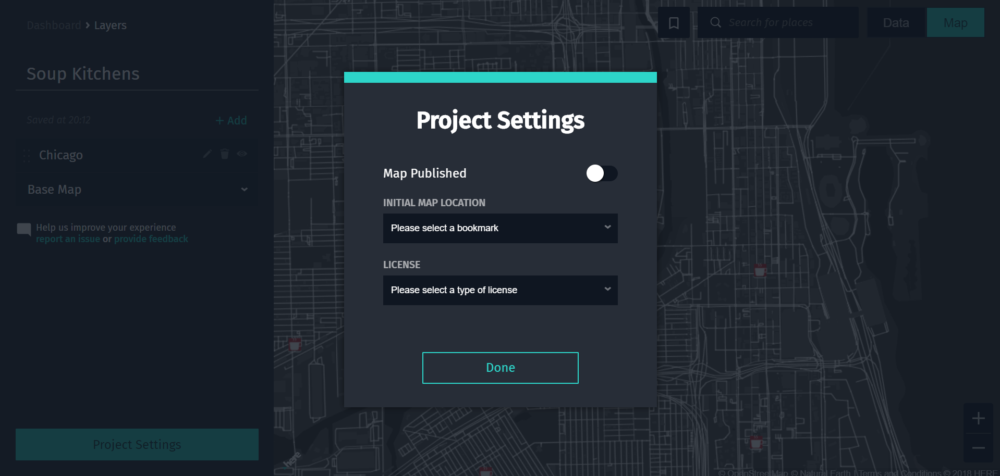
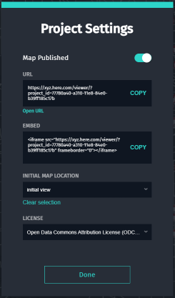

# Publish

One of the most powerful features of HERE Studio is that it allows you to publish your map
without having to run your own infrastructure and update the content
whenever necessary.

You can share a link to your map or copy & paste a snippet of code that you can
directly include on a web page or in a blog for example.

See the following video overview:
<video width="100%"  controls>
  <source src="../videos/publish-legend.mp4" type="video/mp4">
  <source src="../../videos/publish-legend.mp4" type="video/mp4">
You can view a video overview of this content <a href="../videos/publish-legend.mp4">here</a>.
</video>

## Project Settings

You can control the publishing from the **Project Settings** dialog. From there you can see if
the map is currently visible to others.

By default, every map you create with HERE Studio is private and visible only to you until you decide to publish it.

Your published map will be shown to people as you see it right now when you turn publishing on.
To start with a different initial view, choose from a list of previously defined bookmark locations.
The is what your audience sees first, but also for them the map is fully interactive and they
can still pan and zoom on your published map.

Also, you can select a license to share the map with others, but it isn't necessary.

## Publish Settings

All you have to do to publish the map is to turn publishing on (you can turn it off anytime
again as well if you wish).

When the map is published, you will also see the **URL** where it can be reached. You can copy this and
share it with people directly or you can link to it from somewhere like blog or wikipage.

You can also copy the **EMBED** code and use it directly in the code of your website or blog.
It is HTML that will show your map directly on the page. Make sure that your blog accepts
raw HTML and does not convert it to text. The map will appear inline where you put that snippet
of code on your page.
