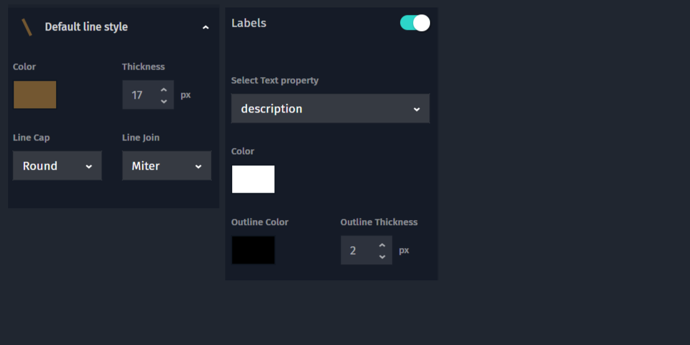
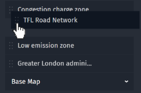
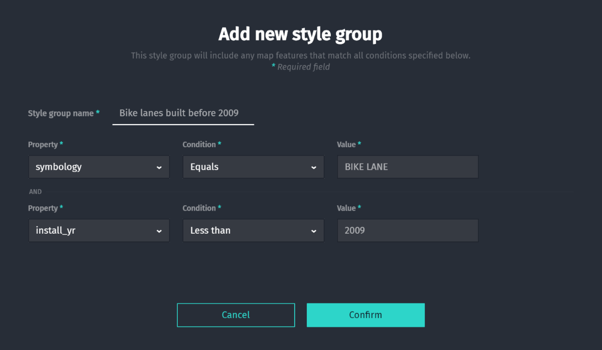
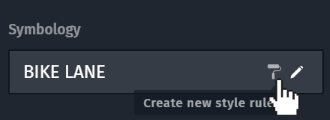

# Styles

## Simple styles

Studio allows you to control the visual appearance of your features. This is
called a _style_ and there are different options between the basic primitives
of _Points_,_Lines_ and _Polygons_.

See the following video overview:
<video width="100%"  controls>
  <source src="../videos/simple-styles.mp4" type="video/mp4">
  <source src="../../videos/simple-styles.mp4" type="video/mp4">
You can view a video overview of this content <a href="../videos/simple-styles.mp4">here</a>.
</video>

### Points

Points features are just at one single location on the map. This location can
be highlighted by a **Marker** like a circle or square, an **Icon** image as
well as a **Label** text coming from the feature properties. The text and icon
can be shifted relative to the markers position to appear on top of or next to
the marker.

### Lines

Lines features connect two or more locations with a straight line. You can
control color as well as the **Cap** style how the line ends and the the
**Join** style which defines how two line segments connect to each other.
You can place a **Label** on the line, which is drawn on each segment

### Polygons

Polygon features are lines closed up to describe an area. The area and the
circumfence line can have different colors and the line thickness can be
adjusted (also to zero, which means no lines is drawn). A **Label** text can
optionally be drawn at the center of the polygon, or shifted from the center
by an offset.

## Drawing order

The order of the list of layers on your map also defines the order in which
they will be drawn on top of each other. Think about a number of transparent
sheets placed one on top of another on top of the underlying map. You can
change this order by dragging layers up or down in this list.

See the following video overview:
<video width="100%"  controls>
  <source src="../videos/drawing-order.mp4" type="video/mp4">
  <source src="../../videos/drawing-order.mp4" type="video/mp4">
You can view a video overview of this content <a href="../videos/drawing-order.mp4">here</a>.
</video>

## Interactive cards

The map can show interactive cards that allows viewers to see more of the data of a
feature they select. The **Cards** list allows re-ordering of the properties, while
all entries below the line will stay hidden. The first line becomes the title of the card.

See the following video overview:
<video width="100%"  controls>
  <source src="../videos/interactive-cards.mp4" type="video/mp4">
  <source src="../../videos/interactive-cards.mp4" type="video/mp4">
You can view a video overview of this content <a href="../videos/interactive-cards.mp4">here</a>.
</video>

## Conditional styles

Features can have more than one style, which means that you can change the look of a feature
based on it's properties or have one feature drawn multiple times and get an overlay effect.
This is probably one of the more powerful styling features as it enables your data to influence
the look of the map.

See the following video overview:
<video width="100%"  controls>
  <source src="../videos/conditional-styling.mp4" type="video/mp4">
  <source src="../../videos/conditional-styling.mp4" type="video/mp4">
You can view a video overview of this content <a href="../videos/conditional-styling.mp4">here</a>.
</video>

When you select to **Add a new style** a selection dialog first asks you for the group of
features this style should apply to. To narrow down the group from all features in your dataset
you need to define one (or multiple) _conditions_ on properties which features must meet to
be considered part of the group.

> #### Tip
>
> It is helpful to first get an overview of the data properties by looking at the data in
> the table view. You can also quickly define a **new rule** for a selected feature by
> clicking on the _paint roller_ icon of the value in the form.
>
> 
