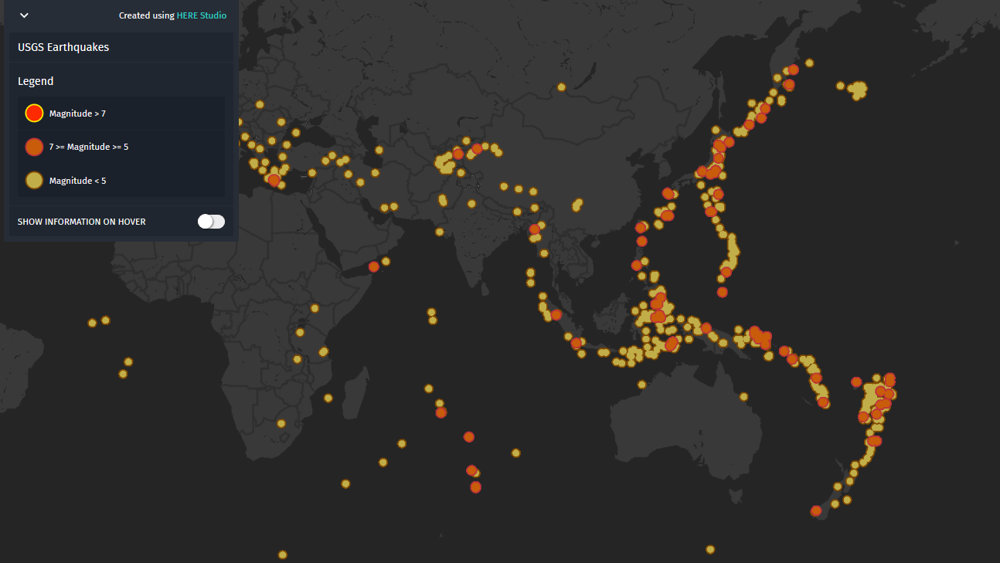

# USGS Earthquake Data on Hub

The [US Geological Survey](https://www.usgs.gov/) offers a variety of monitored data (volancoes, fires, landslides, etc). For the Hub we implemented realtime data from the [USGS earthquake API](https://earthquake.usgs.gov/fdsnws/event/1/) as a shared space `ID: OgCV7ETt`. The API offers earthquakes from the last 30 days by default and allows to narrow down the search by filtering for magnitude, significance, depth or a specific date.

| Shared Space ID | Source | Example |
| ---- | ----- | ----- |
| OgCV7ETt | https://earthquake.usgs.gov/fdsnws/event/1/ | https://studio.here.com/viewer/?project_id=bd0d680d-3451-449c-a850-526b262a19a8 |

#### Notes
Does not support 
- DeleteFeatures
- LoadFeatures
- ModifyFeatures
- GetFeaturesByGeometry (POST)
