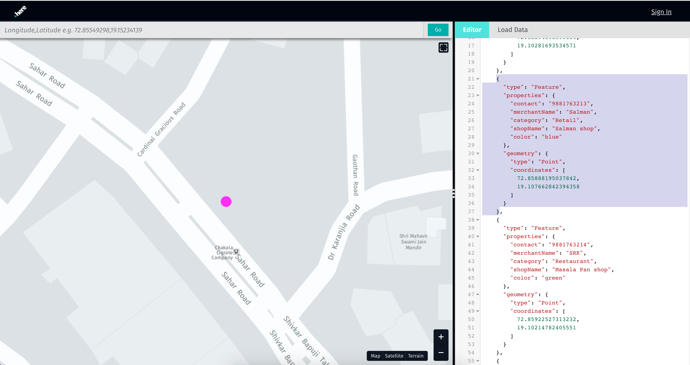
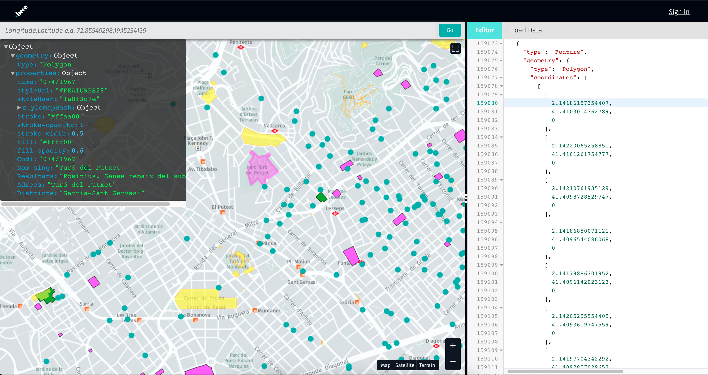
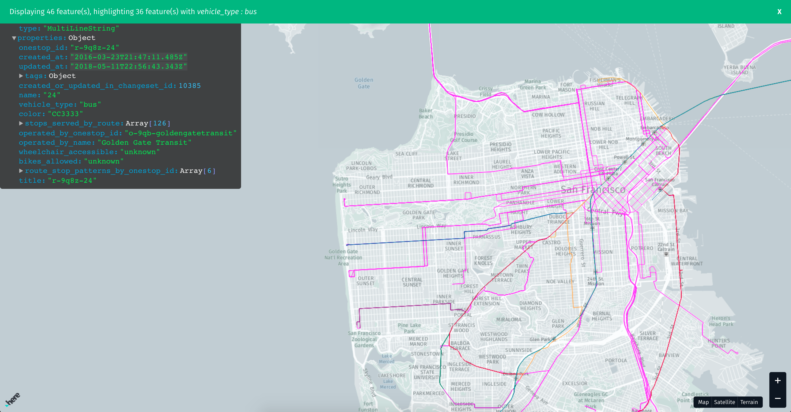
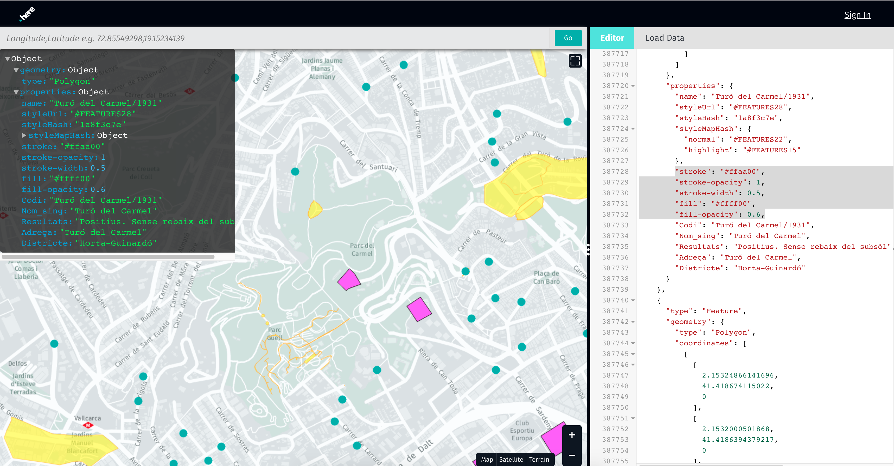
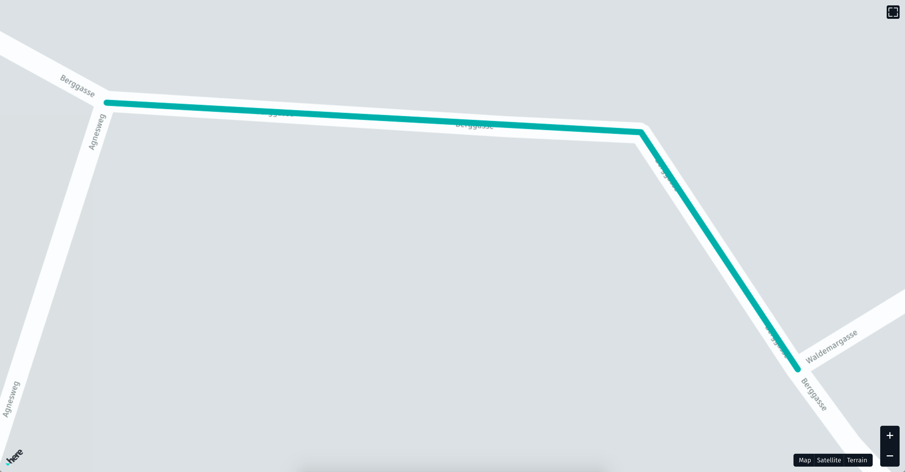

## Advanced concepts

### Locating content

#### From editor to map

Selecting an entire feature object in editor this will be zoom to in the map and highlighted with a magenta color.

[](../assets/images/viewer-locating-content-1.png)

Selecting any latitude and longitude of geometry from the editor, this point will be centered and highlighted on that map.

[](../assets/images/viewer-locating-content-2.png)

#### From map to editor

Clicking on rendered feature on map it will be highlighted with magenta color and cursor will jump to respective feature in editor

[](../assets/images/viewer-locating-content-3.png)

### Filtering data
Selecting a feature on map, clicking on a property label in the feature explorer pop-up card,this will highlight all features with that same property value.

!!! example
    After clicking on the `vehicle_type` label in the overlay, all features with that same value (e.g. bus) are highlighted magenta
    [](../assets/images/viewer-filtering-data.png)

### Styling hints
When some styling hints are present in the feature it renders with the given style on the map. Examples are the following
key/value pairs for defining the line and fill styles:

```
    "stroke": "#ffaa00",
    "stroke-opacity": 1,
    "stroke-width": 0.5,
    "fill": "#ffff00",
    "fill-opacity": 0.6
```

[](../assets/images/viewer-styling-hints.png)

### Data URL

GeoJSON can also be loaded and visualized directly by passing the source of the data in the URL with the named `url` parameter:

!!! example "Single source"
    http://geojson.tools/?url=http://cms.in.here.com/v2/road/pvid/809297026?clientId=sis

!!! example "Multiple sources"
    http://geojson.tools/?url=http://cms.in.here.com/v2/road/pvid/809297026?clientId=sis;http://cms.in.here.com/v2/road/pvid/62884993?clientId=sis

### Embedding the viewer

The GeoJSON tool can be used to embed a map with features on any web page using an `iframe`. For this, the parameter `maponly=true` needs to be passed as well, which will hide the viewer controls and show only the map and content.

!!! example
    http://geojson.tools/?url=http://cms.in.here.com/v2/road/pvid/809297026?clientId=sis&maponly=true

    [](../assets/images/maponly.png)


